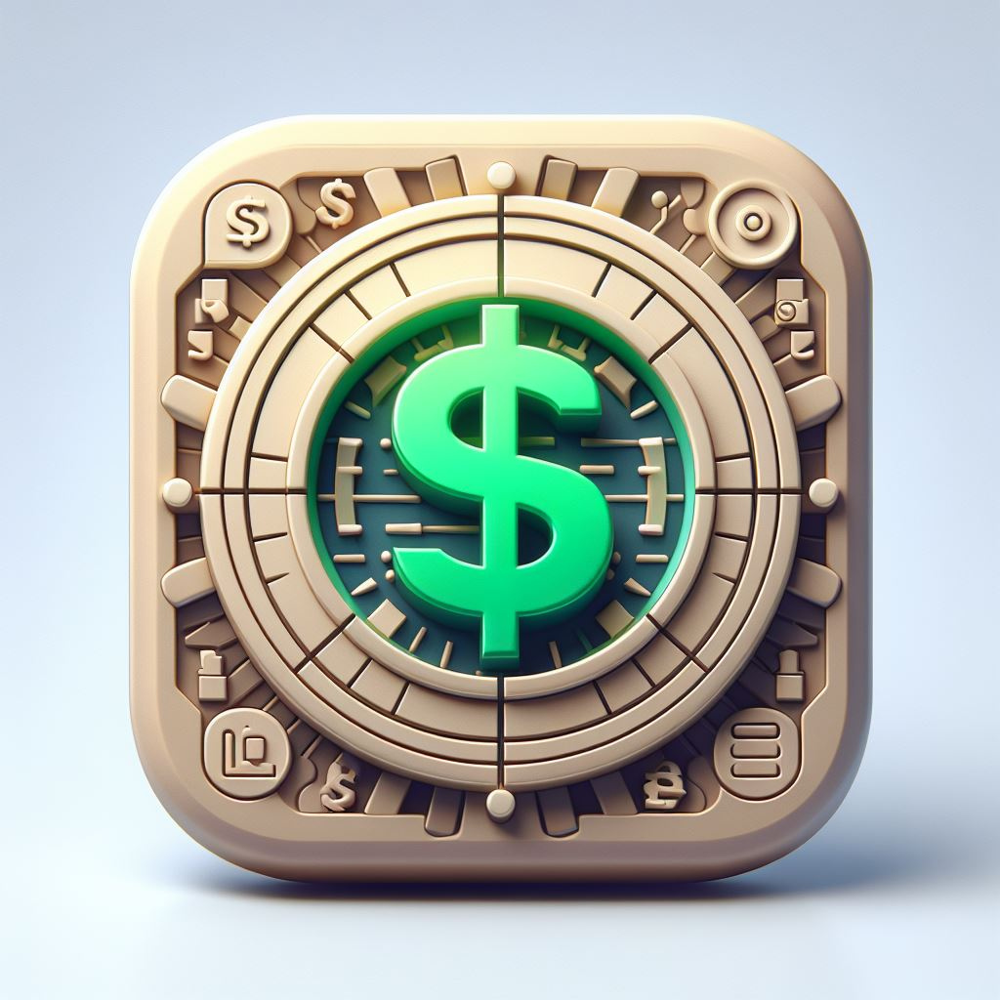
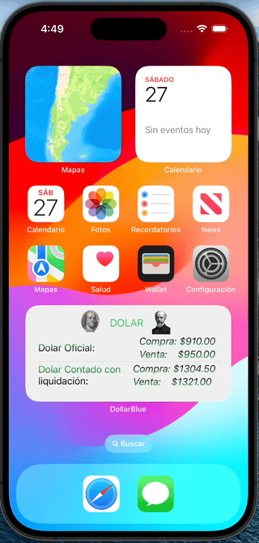
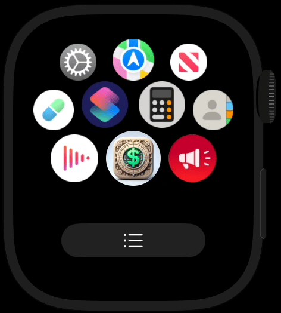

# DollarBlue

<div align="center">
  

  <p><strong>A polished SwiftUI market-tracking app for Argentina’s USD exchange rates across iPhone, Apple Watch, and Home Screen widgets.</strong></p>

  <p>
    
    
    
    
    
  </p>
</div>

<div align="center">
  
  
</div>

## Overview

DollarBlue is a multi-platform SwiftUI app that helps users track Argentina’s dollar exchange rates in a fast, visual, and easy-to-read format.

The project includes:

- An iPhone app with a custom floating navigation bar, market overview, settings, and conversion calculator
- An Apple Watch companion for quick quote checking
- Home Screen widgets built with WidgetKit and App Intents

This project was designed as a portfolio-quality SwiftUI application focused on:

- Real product polish
- Strong UI architecture
- Shared state and feature-based organization
- Practical performance improvements for real devices

## What It Does

- Displays multiple USD market references for Argentina
- Highlights featured markets selected by the user
- Sorts quotes by original API order, name, highest/lowest buy, and highest/lowest sell
- Converts between pesos and dollars with a custom numeric input
- Exposes market data on widgets and Apple Watch
- Surfaces connection state and API issues directly in the UI
- Persists user preferences like theme, compact cards, featured markets, and update stamps

## Architecture

The codebase is organized by feature instead of keeping every screen in a single flat `View` folder.

```text
DollarBlue
├── DollarBlue
│   ├── Shared
│   │ 
│   ├── Model
│   │   
│   └── View
│       ├── Core
│       │
│       ├── Home
│       │   
│       ├── Calculator
│       │
│       └── Config
│
├── DollarBlue Watch App
└── Widget
```

### Architectural Notes

- `QuoteStore` is the shared source of truth for iOS quote loading and connection state (POO)
- iOS views read shared data through SwiftUI Observation instead of duplicating fetch logic per screen
- Main screen files (`HomeView`, `CalculationView`, `ConfigView`) act as lightweight orchestrators
- Feature sections and supporting components live outside the main file for clearer ownership and maintenance
- Shared UI styling lives in `PremiumDesignSystem`

## Technical Highlights

- `SwiftUI` for the full app UI
- `Observation` for shared app state
- `URLSession`-based networking through existing package dependencies
- `WidgetKit` + `AppIntentTimelineProvider` for configurable widgets
- `UIViewRepresentable` to bridge a custom UIKit numeric text field into SwiftUI
- Reusable premium design system with glass/material fallback behavior across supported iOS versions

## UX and Performance Work

Recent work in this project focused on improving runtime behavior without changing the intended visual design:

- Centralized initial quote loading into a shared store
- Floating custom tab bar
- Switched bottom inset propagation to a cheaper dynamic inset path
- Moved expensive repeated calculations out of large screen bodies where possible
- Split large SwiftUI screens into feature components for easier maintenance and more stable updates

## Data Source

The app consumes public market data from DolarApi.

- API docs: [DolarApi](https://dolarapi.com/)

No custom backend is required for the project.

## Apple Platform Alignment

This project follows platform-native building blocks documented by Apple, including:

- [Managing user interface state](https://developer.apple.com/documentation/swiftui/managing-user-interface-state/)
- [TabView](https://developer.apple.com/documentation/swiftui/tabview)
- [Grouping data with lazy stack views](https://developer.apple.com/documentation/swiftui/grouping-data-with-lazy-stack-views)
- [UIViewRepresentable](https://developer.apple.com/documentation/swiftui/uiviewrepresentable/)
- [Keeping a widget up to date](https://developer.apple.com/documentation/widgetkit/keeping-a-widget-up-to-date)

## Why This Project Matters

DollarBlue is not just a UI demo. It shows product thinking across multiple Apple surfaces:

- iPhone app
- Apple Watch companion
- Home Screen widgets

It also demonstrates the kind of work that matters in professional apps.

- Designing and iterating on a product-facing SwiftUI interface
- Refactoring architecture without losing features
- Improving performance after real-device testing
- Handling shared state, settings, widgets, and multiple targets in one codebase

## Getting Started

1. Clone the repository

```bash
git clone https://github.com/SebasYa/DollarBlue.git
cd DollarBlue
```

2. Open `DollarBlue.xcodeproj` in Xcode
3. Select the iOS, watchOS, or widget target you want to run
4. Build and run on a simulator or device

## Recruiter Snapshot

If you are reviewing this repository as a recruiter or hiring manager, this project demonstrates:

- Strong SwiftUI composition and multi-target Apple platform work
- A practical approach to state sharing and feature organization
- Attention to UI quality, design systems, and device-specific UX
- Real refactoring and performance optimization work, not only static mockups

---
